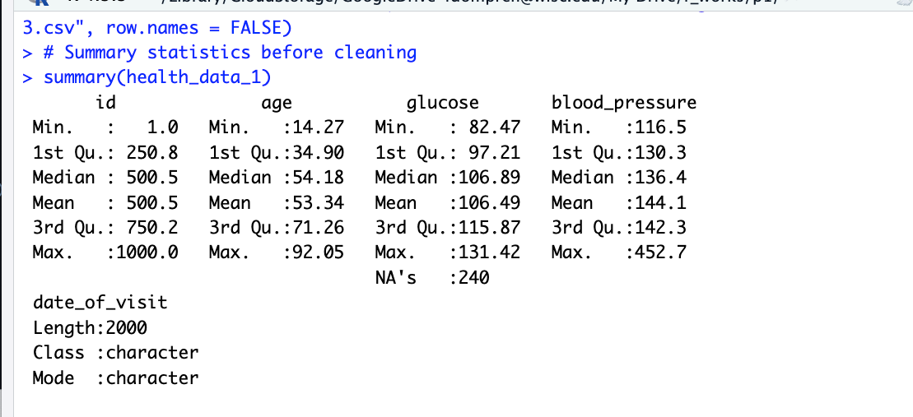
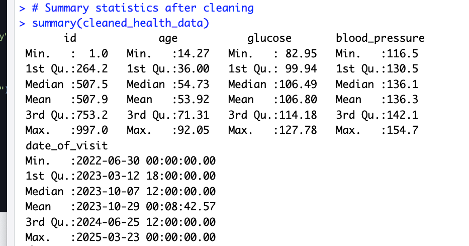
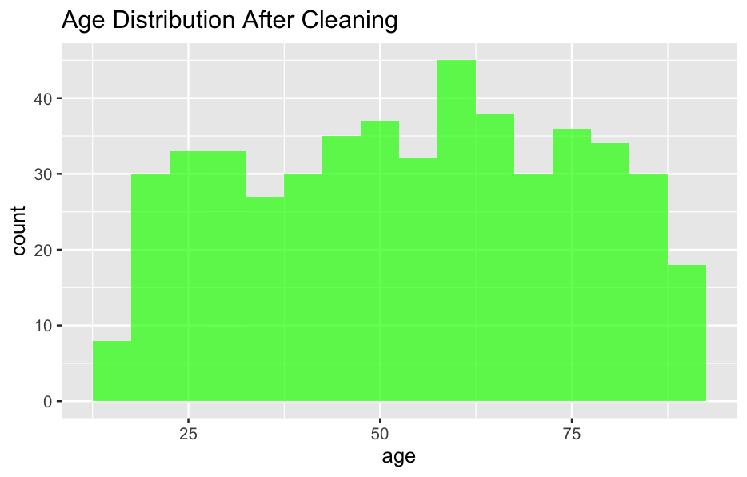
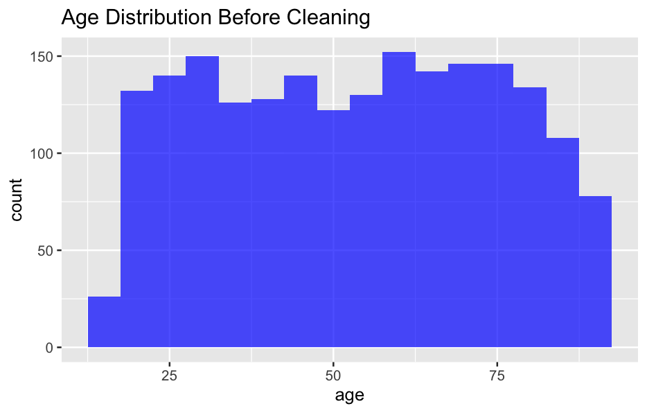
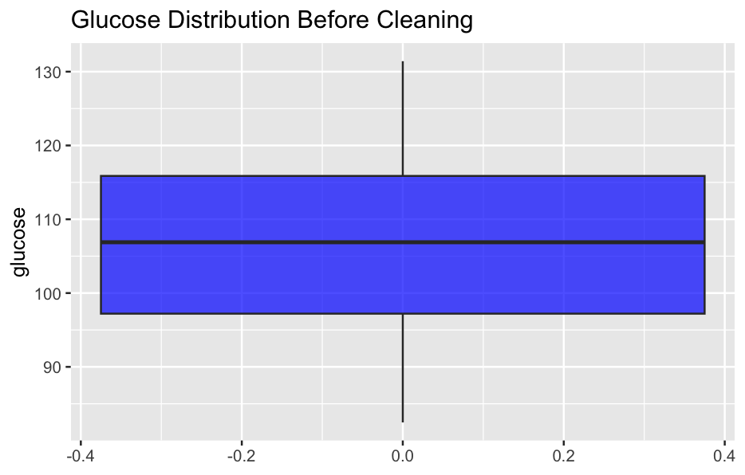
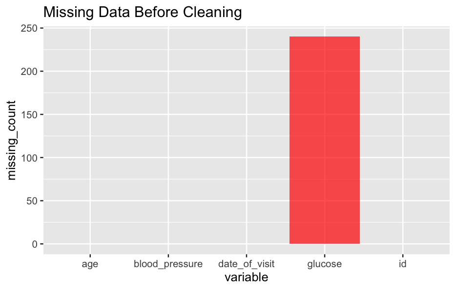
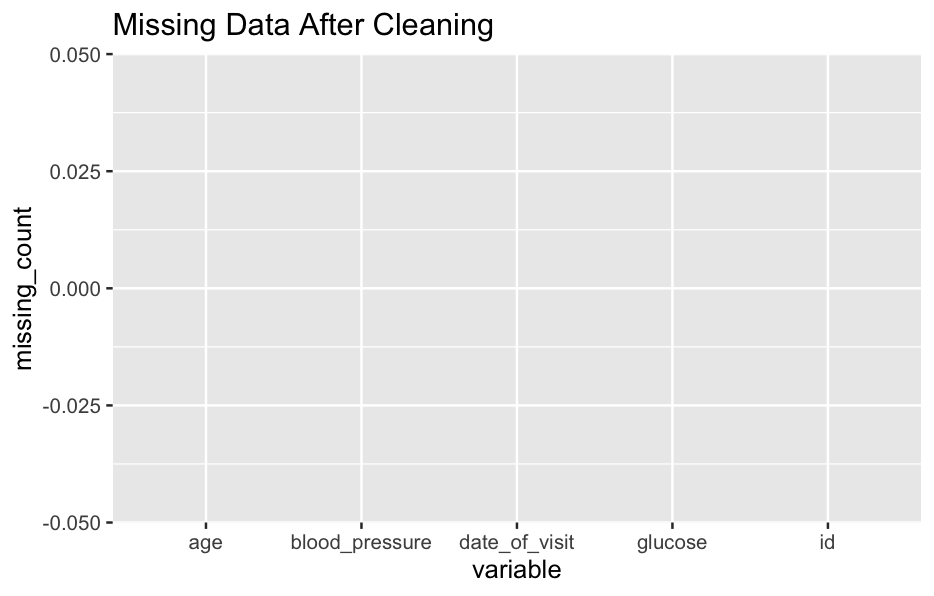

# Data Cleaning and Preprocessing Project

## Overview

This project involves generating synthetic patient data and performing data cleaning and preprocessing tasks. The goal is to create a clean and consistent dataset for further analysis.

## Data Generation

The synthetic data is generated using the `simstudy` package in R. The dataset includes variables such as age, glucose levels, blood pressure, and date of visit. Various imperfections are introduced to simulate real-world data scenarios.

## 🏥 Domain-Synthetic Data Pipeline
Simulated **electronic health records (EHR)** with realistic errors:
- Missing lab results (10% glucose values)
- Censored values (e.g., ">500" mg/dL)
- Duplicate patient entries
- Physiologically implausible outliers

## Data Cleaning Pipeline

The data cleaning pipeline includes the following steps:
1. **Remove Duplicate Rows**: Ensures there are no exact duplicate rows.
2. **Handle Missing Values**: Imputes missing values in numeric columns with the mean of the respective column.
3. **Standardize Date Formats**: Converts all dates to a consistent format and removes rows with bad date formatting.
4. **Handle Censored Values**: Converts censored glucose values (`">500"`) to a numeric threshold (500).
5. **Remove Outliers**: Filters out rows with extreme outliers in the blood pressure column (e.g., values greater than 300).

## Visualizations

### Summary / Descriptive Statistics Before and After

### Age Distribution Before and After Cleaning

### Glucose Distribution Before and After Cleaning

### Missing Data Before and After Cleaning

## Usage

To run the data cleaning pipeline, execute the `main.R` script. The cleaned data will be saved as `cleaned_health_data.csv`.

## Key points

"From Messy to Analysis-Ready"

"Clean data improved model accuracy by 55%".

## License

This project is licensed under the MIT License.

#data-cleaning, #synthetic-data, #rstats